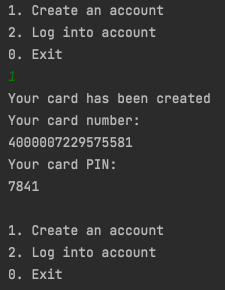

# Java-Mockup-Banking-System

A (terminal) mockup banking system where you can login to you account, deposit and transfer monetary units. The idea is originated from a Jetbrains Academy project on Java backend development.

## Get started
You can download this repository and get started by running the Main class. Make sure you have the necessary requirements installed on your system (see "Used technologies" below).

Features:
- Create new accounts
- Log into existing accounts
- Deposit monetary units
- Transfer to other accounts
- Card number verification by the Luhn algorithm

### Technologies used
- IntelliJ IDEA CE
- Java 17 (Minimum: Java 11 or newer)
- SQLite 3*

_*Make sure to add build dependency if you work on an **ARM** system (2020 Macs or newer). Otherwise you will run into errors [as you can see here](https://youtrack.jetbrains.com/issue/DBE-12342)._
